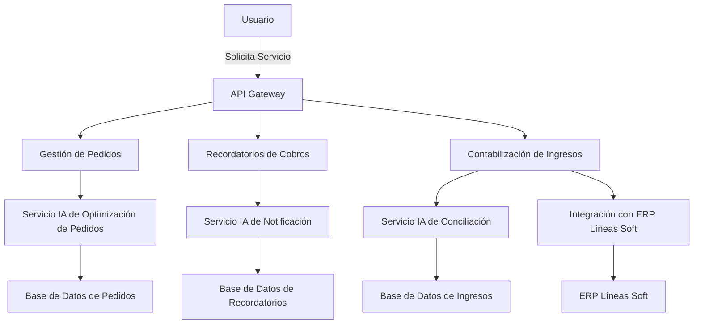

```markdown
# Documento de Arquitectura: Implementación de IA en aceitesuicos.com

## 1. Introducción
Este documento describe la arquitectura del sistema propuesto para la automatización de la gestión de pedidos y la contabilización de ingresos bancarios mediante inteligencia artificial (IA) en aceitesuicos.com. Se abordan los módulos principales, la estructura de la base de datos y las tecnologías recomendadas, asegurando que la solución sea escalable, mantenible y eficiente.

## 2. Arquitectura del Sistema

### 2.1. Diagrama de Arquitectura de Alto Nivel


### 2.2. Módulos Principales
1. **API Gateway**: Punto de entrada para la comunicación entre el usuario y los servicios del sistema.
2. **Gestión de Pedidos**: 
   - Automatiza la gestión y optimización de pedidos.
   - Se comunica con el servicio de IA para optimización de rutas.
3. **Recordatorios de Cobros**: 
   - Genera y envía recordatorios automatizados de cobros utilizando IA generativa.
4. **Contabilización de Ingresos**: 
   - Interpreta conceptos de transferencias bancarias utilizando IA.
   - Casamiento automático de ingresos con datos de facturas.
5. **Integración con ERP**:
   - API para la conexión con Líneas Soft para operaciones de importación/exportación de datos.
6. **Servicios IA**: 
   - Servicios dedicados a las funcionalidades de IA necesarias para la optimización de pedidos, notificaciones y conciliación.

### 2.3. Estructura de la Base de Datos
**Modelo Relacional:**

1. **Tabla de Pedidos**
   - ID (PK)
   - ClienteID (FK)
   - FechaPedido
   - MontoTotal
   - Status

2. **Tabla de Recordatorios**
   - ID (PK)
   - PedidoID (FK)
   - FechaEnvio
   - Mensaje
   - Estado

3. **Tabla de Ingresos**
   - ID (PK)
   - Concepto
   - Monto
   - FechaIngreso
   - Estado

4. **Tabla de Clientes**
   - ClienteID (PK)
   - Nombre
   - Email
   - Teléfono

5. **Tabla de Transferencias**
   - ID (PK)
   - Concepto
   - Monto
   - Fecha

### 2.4. Tecnologías Propuestas
- **Backend**: 
  - Node.js con Express para la creación de la API.
- **IA**: 
  - Python con bibliotecas como TensorFlow o PyTorch para el desarrollo de modelos de IA.
- **Base de Datos**: 
  - PostgreSQL como sistema de gestión de base de datos.
- **API Integration**: 
  - RESTful APIs para la integración con el ERP Líneas Soft.
- **Frontend**:
  - React.js para la interfaz de usuario.
- **Mensajería**: 
  - RabbitMQ o Kafka para la gestión de tareas asincrónicas.

## 3. Consideraciones de Escalabilidad y Rendimiento
- **Escalabilidad**: Se utilizarán microservicios para cada módulo del sistema, permitiendo escalar independientemente según la carga de trabajo. La arquitectura basada en contenedores (Docker) facilitará la gestión y despliegue de los servicios.
  
- **Rendimiento**: El uso de cachés (Redis o Memcached) para almacenar datos frecuentes reducirá la carga en la base de datos y mejorará el tiempo de respuesta del sistema.

## 4. Seguridad
- **Autenticación y Autorización**: Implementación de OAuth 2.0 para asegurar que solo usuarios autenticados puedan realizar acciones en el sistema.
- **Protección de Datos**: Encriptación de datos sensibles y cumplimiento con normativas de privacidad.
  
## 5. Conclusiones
La arquitectura propuesta proporciona una solución eficiente y escalable para la automatización de procesos en aceitesuicos.com. Cada componente ha sido diseñado considerando los requisitos funcionales y no funcionales del sistema. Esta propuesta sienta las bases para el desarrollo exitoso del proyecto en las fases programadas.
```
