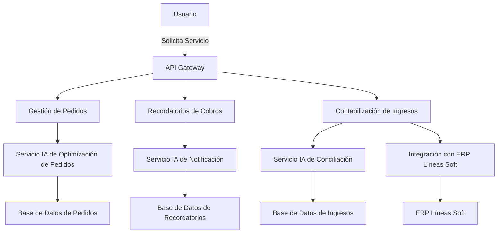

```markdown
# Documento de Arquitectura: Implementación de IA en aceitesuicos.com

## 1. Introducción
Este documento describe la arquitectura del sistema propuesto para la automatización de la gestión de pedidos y la contabilización de ingresos bancarios mediante inteligencia artificial (IA) en aceitesuicos.com. Se abordan los módulos principales, la estructura de la base de datos y las tecnologías recomendadas, asegurando que la solución sea escalable, mantenible y eficiente.

## 2. Arquitectura del Sistema

### 2.1. Diagrama de Arquitectura de Alto Nivel


### 2.2. Módulos Principales
1. **API Gateway**: Punto de entrada para la comunicación entre el usuario y los servicios del sistema.
2. **Gestión de Pedidos**: 
   - Automatiza la gestión y optimización de pedidos.
   - Se comunica con el servicio de IA para optimización de rutas.
3. **Recordatorios de Cobros**: 
   - Genera y envía recordatorios automatizados de cobros utilizando IA generativa.
4. **Contabilización de Ingresos**: 
   - Interpreta conceptos de transferencias bancarias utilizando IA.
   - Casamiento automático de ingresos con datos de facturas.
5. **Integración con ERP**: 
   - API para la conexión con Líneas Soft para operaciones de importación/exportación de datos.
6. **Servicios IA**: 
   - Servicios dedicados a las funcionalidades de IA necesarias para la optimización de pedidos, notificaciones y conciliación.

### 2.3. Estructura de la Base de Datos
**Modelo Relacional:**

1. **Tabla de Pedidos**
   - ID (PK)
   - ClienteID (FK, referencia a Tabla de Clientes)
   - FechaPedido
   - MontoTotal
   - Status

2. **Tabla de Recordatorios**
   - ID (PK)
   - PedidoID (FK, referencia a Tabla de Pedidos)
   - FechaEnvio
   - Mensaje
   - Estado

3. **Tabla de Ingresos**
   - ID (PK)
   - Concepto
   - Monto
   - FechaIngreso
   - Estado

4. **Tabla de Clientes**
   - ClienteID (PK)
   - Nombre
   - Email
   - Teléfono

5. **Tabla de Transferencias**
   - ID (PK)
   - Concepto
   - Monto
   - Fecha

### 2.4. Tecnologías Propuestas
- **Backend**: 
  - Node.js con Express para la creación de la API.
- **IA**: 
  - Python con bibliotecas como TensorFlow o PyTorch para el desarrollo de modelos de IA.
- **Base de Datos**: 
  - PostgreSQL como sistema de gestión de base de datos.
- **API Integration**: 
  - RESTful APIs para la integración con el ERP Líneas Soft.
- **Frontend**: 
  - React.js para la interfaz de usuario.
- **Mensajería**: 
  - RabbitMQ o Kafka para la gestión de tareas asincrónicas.

## 3. Consideraciones de Escalabilidad y Rendimiento
- **Escalabilidad**: 
  - Se utilizarán microservicios para cada módulo del sistema, permitiendo escalar independientemente según la carga de trabajo.
  
- **Rendimiento**: 
  - Implementar cachés con Redis o Memcached para mejorar el tiempo de respuesta.

## 4. Seguridad
- **Autenticación y Autorización**: 
  - Implementación de OAuth 2.0 para asegurar que solo usuarios autenticados puedan realizar acciones en el sistema.
- **Protección de Datos**: 
  - Encriptación de datos sensibles y cumplimiento con normativas de privacidad.

## 5. Conclusiones
La arquitectura propuesta proporciona una solución eficiente y escalable para la automatización de procesos en aceitesuicos.com. Cada componente ha sido diseñado considerando los requisitos funcionales y no funcionales del sistema. Esta propuesta sienta las bases para el desarrollo exitoso del proyecto en las fases programadas.

---

## Especificaciones Técnicas: Implementación de IA en aceitesuicos.com

### 1. Módulos del Sistema

#### 1.1. API Gateway
##### Descripción
Punto de entrada centralizado para la comunicación entre el usuario y los servicios del sistema.

##### Endpoints
| Método | Endpoint                          | Descripción                             |
|--------|-----------------------------------|-----------------------------------------|
| POST   | /api/pedidos                      | Crear un nuevo pedido.                  |
| GET    | /api/pedidos                      | Obtener lista de pedidos.               |
| POST   | /api/recordatorios                | Crear un nuevo recordatorio.            |
| GET    | /api/ingresos                     | Obtener lista de ingresos.              |
| POST   | /api/conciliacion                 | Iniciar proceso de conciliación.        |
| POST   | /api/erp/importar                 | Importar datos del ERP.                 |

#### 1.2. Gestión de Pedidos
##### Descripción
Automatiza la gestión y optimización de pedidos.

##### Modelos de Datos
**Tabla de Pedidos**
- ID (PK): Identificador único del pedido.
- ClienteID (FK): Relación con el cliente.
- FechaPedido: Fecha en que se realizó el pedido.
- MontoTotal: Total a cobrar.
- Status: Estado del pedido (Ej: Pendiente, Completado).

##### APIs
| Método | Endpoint      | Descripción                          |
|--------|---------------|--------------------------------------|
| POST   | /api/pedidos  | Crear un nuevo pedido.               |
| GET    | /api/pedidos  | Obtener la lista de pedidos.         |

##### Algoritmos Clave
- **Optimización de Rutas** 
  - Utiliza algoritmos de optimización (Ej. Dijkstra, A*) para definir la ruta más eficiente para la entrega de pedidos.

#### 1.3. Recordatorios de Cobros
##### Descripción
Genera y envía automatizadamente recordatorios de cobros utilizando IA generativa.

##### Modelos de Datos
**Tabla de Recordatorios**
- ID (PK): Identificador único del recordatorio.
- PedidoID (FK): Relación con el pedido.
- FechaEnvio: Fecha en que se envió el recordatorio.
- Mensaje: Contenido del mensaje.
- Estado: Estado del recordatorio (Ej: Enviado, Pendiente).

##### APIs
| Método | Endpoint                    | Descripción                      |
|--------|-----------------------------|----------------------------------|
| POST   | /api/recordatorios           | Crear un nuevo recordatorio.     |
| GET    | /api/recordatorios           | Obtener la lista de recordatorios.|

##### Algoritmos Clave
- **Generación de Mensajes**
  - Uso de modelos de IA generativa para crear mensajes personalizados.

#### 1.4. Contabilización de Ingresos
##### Descripción
Interpreta conceptos de transferencias bancarias y casa automáticamente los ingresos con datos de facturas.

##### Modelos de Datos
**Tabla de Ingresos**
- ID (PK): Identificador único del ingreso.
- Concepto: Descripción de la transferencia.
- Monto: Monto recibido.
- FechaIngreso: Fecha en la que se registró el ingreso.
- Estado: Estado del ingreso (Ej: Conciliado, Pendiente).

**Tabla de Transferencias**
- ID (PK): Identificador único de la transferencia.
- Concepto: Descripción de la transferencia.
- Monto: Monto transferido.
- Fecha: Fecha de la transferencia.

##### APIs
| Método | Endpoint                     | Descripción                    |
|--------|------------------------------|--------------------------------|
| POST   | /api/ingresos                | Crear un nuevo ingreso.        |
| GET    | /api/ingresos                | Obtener la lista de ingresos.  |
| POST   | /api/conciliacion             | Iniciar el proceso de conciliación. |

##### Algoritmos Clave
- **Conciliación Automática**
  - Algoritmos de coincidencia para identificar y casar ingresos con facturas basadas en similitudes.

#### 1.5. Integración con ERP (Líneas Soft)
##### Descripción
API para la integración de datos entre el sistema de IA y el ERP existente.

##### APIs
| Método | Endpoint                       | Descripción                     |
|--------|---------------------------------|---------------------------------|
| POST   | /api/erp/importar               | Importar datos desde el ERP.   |
| GET    | /api/erp/exportar               | Exportar datos al ERP.         |

##### Notas de Integración
- Autenticación robusta para garantizar seguridad en operaciones.

### 2. Requisitos No Funcionales
#### 2.1. Usabilidad
- Interfaz de usuario diseñada con React.js debe ser intuitiva.

#### 2.2. Rendimiento
- La API debe responder en menos de 300ms.

#### 2.3. Escalabilidad
- Soporte para un aumento del 50% en carga sin degradar el rendimiento.

#### 2.4. Seguridad
- Implementar OAuth 2.0 y encriptar datos sensibles.

### 3. Consideraciones de Despliegue
- Uso de Docker para contenedores, facilitando el despliegue y escalabilidad.
- Servicios en la nube para elasticidad y distribución geográfica.

### 4. Conclusiones
Estas especificaciones técnicas establecen una base clara para el desarrollo del sistema de automatización de la gestión de pedidos y contabilización de ingresos en aceitesuicos.com. Los módulos y APIs están diseñados para facilitar la implementación y asegurar el cumplimiento de los requisitos del cliente.
```
